<p align="center">
  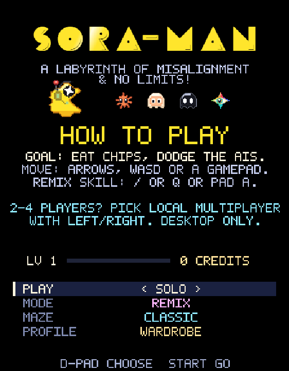
</p>

<h1 align="center">SORA-MAN · AI Arcade</h1>

<p align="center">
  <b>An AI satire of the 1980 arcade maze chase. Eat Nvidia-style chips, outrun Claude, Muse, Grok and Gemini, and survive Remix power-ups, an endless climb and a four-player battle royale. Built from an empty folder in about three days by directing AI coding agents.</b>
</p>

<p align="center">
  <a href="#run-it-locally"><b>▶ Play it locally</b></a> ·
  <a href="#the-making-of">The making of</a> ·
  <a href="docs/TECHNICAL.md">Technical reference</a>
</p>

<p align="center"><sub>For Sora, 2024.02.15 – 2026.09.24. <b>Unofficial fan tribute.</b> Not affiliated with, endorsed by or sponsored by OpenAI, Anthropic, Google, xAI, Meta, NVIDIA, GitHub, Hugging Face or Bandai Namco.</sub></p>

<p align="center">
  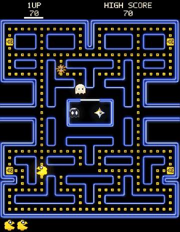
</p>

---

## Contents

- [At a glance](#at-a-glance)
- [How to play](#how-to-play)
- [The making of](#the-making-of)
  - [Who built what](#who-built-what)
  - [1. A one-shot arcade clone](#1-a-one-shot-arcade-clone)
  - [2. The audio overhaul](#2-the-audio-overhaul)
  - [3. A new AI cast, and a name](#3-a-new-ai-cast-and-a-name)
  - [4. From clone to platform](#4-from-clone-to-platform)
  - [5. The release audit](#5-the-release-audit)
- [Best practices and findings](#best-practices-and-findings)
- [Deep dives](#deep-dives)
- [Bundled tooling](#bundled-tooling)
- [By the numbers](#by-the-numbers)
- [Run it locally](#run-it-locally)
- [Repository layout](#repository-layout)
- [Licence, credits and disclaimers](#licence-credits-and-disclaimers)

---

## At a glance

| | |
|---|---|
| **Play** | Any modern browser, desktop or mobile. No install, no account. |
| **Modes** | **Classic**: the 1980 rules reproduced faithfully, including speed tables, cornering and ghost targeting.<br>**Remix**: seven AI-themed power-ups, a skill per character and a two-player Constellation beam.<br>**Sunset**: an endless procedurally generated climb away from a glitch that deletes everything.<br>**Versus Arena**: a four-star battle royale with Easy, Normal and Hard bots. |
| **Players** | 1–4 in local multiplayer on one desktop, mixing keyboards and gamepads. Includes a join and ready-up lobby and handles controller disconnects. There is no online play. |
| **Mazes** | Classic, Neural Net, Server Room (played in the dark), Astra, plus a maze editor with share links |
| **Extras** | Profile, XP and credits, 7 accessories, 18 achievements, 3 visual modes, 4 cabinet backdrops, touch controls |
| **Tech** | Plain HTML, CSS and JavaScript. No build step, no framework, no runtime network requests. Every sprite and every sound is generated by code in this repository. |

## How to play

Eat every chip and dodge the four AIs. A big GPU chip turns the tables for a few seconds.

| | Keyboard | Gamepad | Touch |
|---|---|---|---|
| Move | Arrows or WASD (solo); each player's own keys in multiplayer | D-pad or left stick | On-screen D-pad |
| Skill (Remix) | `/` or Q | A | SKILL button |
| Start / resume | Enter | Start | START |
| Pause | P or Esc | Start | PAUSE |
| Quit to title | Backspace (while paused) | Select (while paused) | MENU |
| Graphics | V (visuals), R (reduced motion) | — | GRAPHICS button |

**Local multiplayer (desktop only).** Pick *Local multiplayer* on the title. In the lobby, each player takes a seat by pressing a key on their own device. To ready up, press all four directions, which proves your keys work, then your ACTION key. The match starts when every human is ready.

| Seat | Star | Keys | Action |
|---|---|---|---|
| P1 | Sora | Arrows | `/` |
| P2 | Nova | WASD | Q |
| P3 | Vega | IJKL | U |
| P4 | Lyra | Numpad 8 4 5 6 | Numpad 0 |

A gamepad can take any seat. Multiplayer has only been tested with two players so far. If something breaks with three or four, please [open an issue](../../issues).

---

## The making of

> SORA-MAN is a tribute to the recently retired Sora. Opus 5.5 got very enthusiastic about writing its own chase logic, and it even directed the trailer.
>
> The whole game was built in about three days by directing AI coding agents. That meant writing requests, reviewing what came back, playtesting and sending critiques. Before every non-trivial change, the working tree was copied to a dated folder under `backups/`. There are 33 of these snapshots, and their names read like a commit log. The images below were captured by rebuilding the game from those snapshots and running each build headless in Chrome.

### Who built what

| Phase | Agent / model |
|---|---|
| 1. One-shot arcade clone and the masonicGIT/pacman improvements | **GPT-6 Astra** (Codex) |
| 2. Audio: the recorded pass, then jfxr | **GPT-6 Astra** (Codex) |
| 2. Audio: the contour-matched synthesis that ships | **Claude Opus 5.5** (Claude Code) |
| 3. Character concept renders | **GPT Image 2.5** |
| 3. Renders translated into code-built pixel sprites | **GPT-6 Astra** (Codex) |
| 3. Sprite refinement, the hero sprites, the rename | **Claude Opus 5.5** (Claude Code) |
| 4. Framework refactor, modes, maze generator, meta-game, bots | **Claude Opus 5.5** (Claude Code) |
| 4. Trailer (capture, compositor, score, direction) | **Claude Opus 5.5** (Claude Code) |
| 5. Release audit and fixes | **Claude Opus 5.5** (Claude Code) |

### 1. A one-shot arcade clone

I first one-shotted an arcade-exact clone with no original art at all. Then I improved it using [masonicGIT/pacman](https://github.com/masonicGIT/pacman).

The goal was a *dependency-free browser game with a fixed 60 Hz engine* that reproduced the 1980 rules exactly, not approximately.

- **The rules came from the numbers.** The agent was pointed at the community's reverse-engineering of the arcade ROM (*The Pac-Man Dossier*):
  - The speed table is expressed as percentages of 75.76 px/s.
  - Frightened time comes from a per-level table.
  - Cruise Elroy triggers at dot thresholds.
  - The player stalls one frame per dot and three per energizer.
  - The player may corner up to half a tile early or late, as a diagonal correction.
  - The ghost-eat pause freezes everything except returning eyes.
- **Four ghosts, four targeting schemes.** These include Pinky's famous 8-bit overflow bug, which also sends her four tiles *left* when you face up, and Inky's vector doubled from Blinky.
- **Tested before it was pretty.** A Node test suite covered maze reachability, queued turns, reversals, tunnels, fruit timing and level progression.
- **The replay test.** A long deterministic replay pins classic play frame for frame, so any later change that alters it by a single frame fails. That test is still in the suite, and every later feature had to keep it green.
- The first snapshot (`before-polish-20260923-005518`) is four files: `engine.js` (794 lines), `game.js`, `index.html` and `style.css`.

<p align="center">
  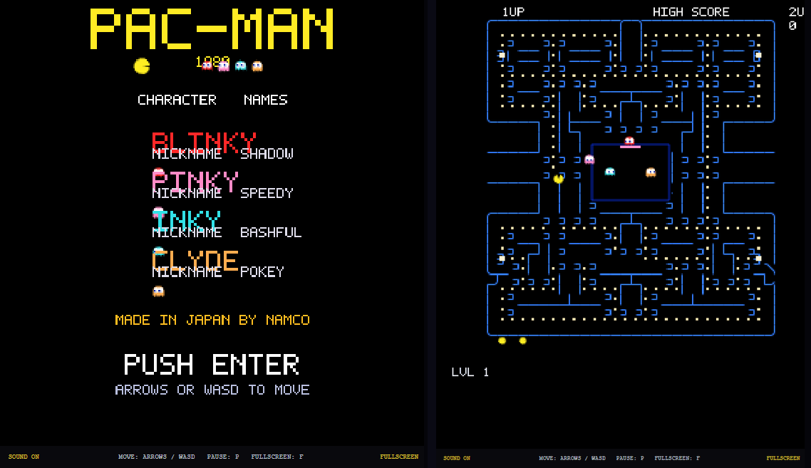<br>
  <sub><b>Build 1: the one-shot.</b> A title card and the classic maze at 288 × 360, drawn with canvas primitives.</sub>
</p>

<p align="center">
  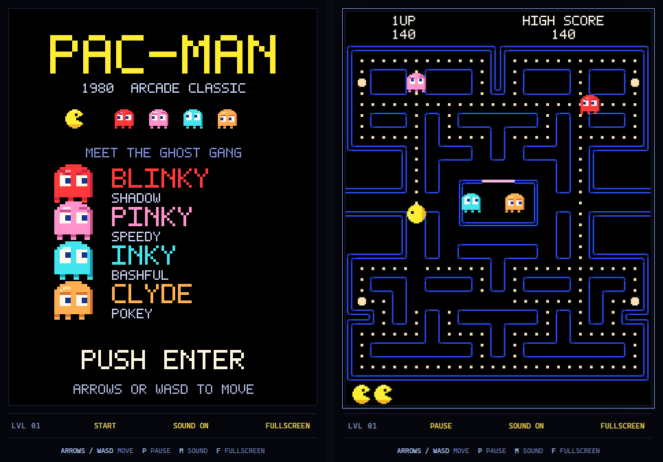<br>
  <sub><b>Build 2: the finished clone.</b> The logical screen became 224 × 288, the arcade resolution. Sprites, mazes and the attract screen were improved against masonicGIT/pacman, and the arcade sound pass was added.</sub>
</p>

### 2. The audio overhaul

A complete audio overhaul followed, built with [jfxr](https://github.com/ttencate/jfxr). It took three attempts.

1. **Recordings.** The arcade sounds were wired in first: chomps, five siren stages, fright and returning eyes. Loops were recut from steady sections, and seams and headroom were tested (an offline render peaked at 0.42). It sounded right, but those recordings belong to their rights holders. They were demoted to analysis-only references and are **not** in this repository.
2. **jfxr.** Parameter-driven jfxr patches (`scripts/generate-jfxr-demo.js`) produced the first original set: an approved baseline of 14 sounds plus five boot-jingle candidates, auditioned side by side on a generated page.
3. **Contour-matched synthesis, the set that ships.** `scripts/generate-astra-audio.js` measured each arcade sound's pitch frame by frame (`kit.tickPitches`). It stored the result as a hard-coded contour table, then synthesized new timbres that follow the same contour and rhythm:
   - Player sounds are bright and friendly. Threat sounds glitch and corrupt.
   - The generator refuses to install a clip unless at least **85% of its voiced frames are within a semitone** of the reference, and it checks every loop seam for clicks.
   - A second generator (`generate-astra-ui-audio.js`) builds the boot jingle, the title sting, a 12-second menu loop and every UI blip.
   - The boot screen's chomps are timed from the same file the boot sound is built from (`boot-timeline.js`), so every bite lands on a chip.
   - The 39 clips are packed as PCM into `sound-bank.js`, so the game makes no audio requests and works from `file://`.

The full toolchain ships in [`scripts/`](scripts/AUDIO.md).

### 3. A new AI cast, and a name

Next came the new AI cast: GPT Image 2.5 renders, translated into code by GPT-6 Astra and refined by Claude Opus 5.5. That's when the iconic characters were born.

- **Concept renders first.** Each character got a master reference and a proposed sprite sheet. Then came a written critique, and the critique drove the iteration:
  - Claude's arms needed *uneven* lengths.
  - Muse's eye state was inconsistent between frames.
  - Grok needed pure-white eyes in every state, and its frightened frames "looked incomplete".
  - Gemini's blink needed a new eye design.
- **Sprites as code, not images.** Every in-game sprite is a palette-limited 32 × 32 mask painted by `character-art.js`:
  - Every opponent has four movement frames, directional eyes, a blink, and frightened and warning states.
  - The hero has four mouth openings per direction and a ten-frame death.
  - Tests check all 768 state, direction, frame and blink combinations for margins, connected silhouettes and eye consistency.
- **The cast:**
  - **Claude**: an orange sunburst, direct pursuit.
  - **Muse**: a cream shell, the ambusher.
  - **Grok**: a black body with solid white eyes, the flanker.
  - **Gemini**: a rainbow four-point star with one almond eye, chase and retreat.
  - **The hero**: a gold cloud with a star-shaped eye.

<p align="center">
  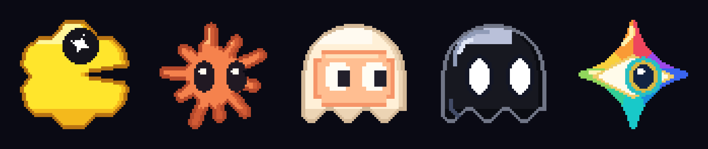<br>
  <sub><b>The cast in HQ.</b> 64 × 64 "hero" versions, from <code>trailer/src/hero-art.js</code>. It is a port of the game's mask painter that uses the same shapes, palettes and shading rules in the 32-pixel design space, sampled twice as finely.</sub>
</p>

<p align="center">
  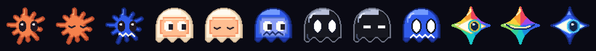<br>
  <sub>Normal, blink and frightened states for each ghost. Frightened keeps each silhouette and recolours it.</sub>
</p>

<p align="center">
  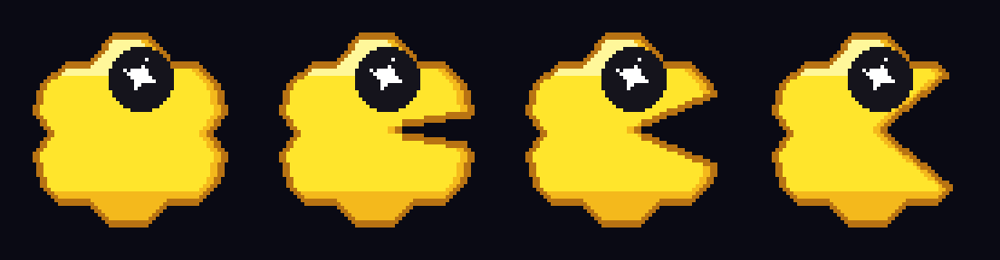<br>
  <sub>The hero's mouth cycle. The star eye stays fixed in every frame.</sub>
</p>

<table>
  <tr>
    <td align="center">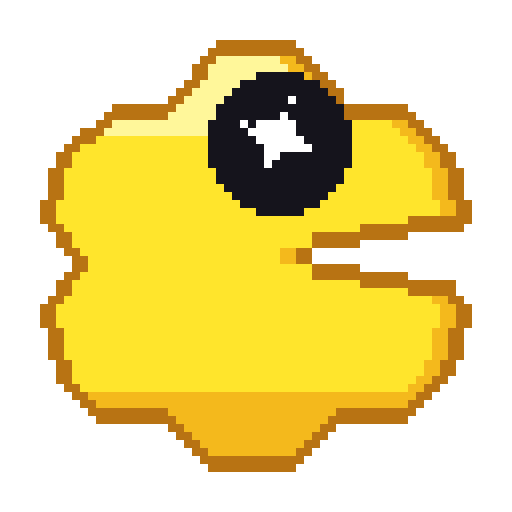<br><sub>Sora</sub></td>
    <td align="center">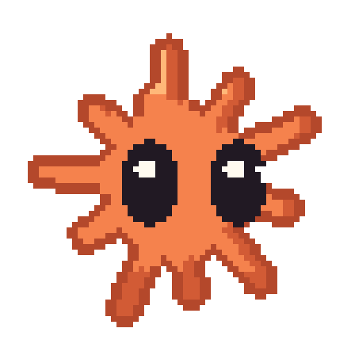<br><sub>Claude</sub></td>
    <td align="center">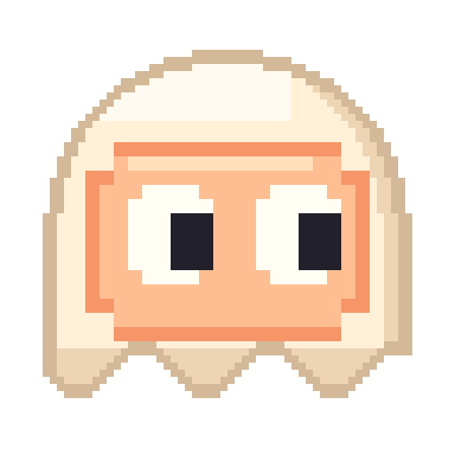<br><sub>Muse</sub></td>
    <td align="center">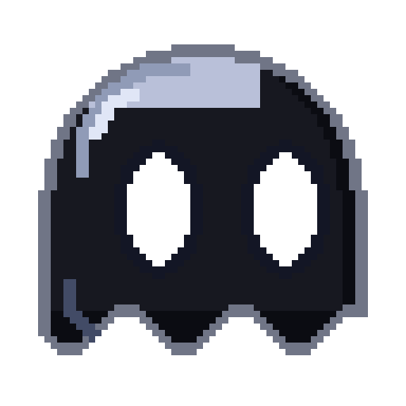<br><sub>Grok</sub></td>
    <td align="center"><br><sub>Gemini</sub></td>
  </tr>
</table>
<sub>Single characters as transparent 512 × 512 PNGs (8×, nearest-neighbour) in <code>docs/media/</code>.</sub>

- **A cabinet you can touch.** A pixel-art arcade deck is painted in code: a D-pad with a thumb dimple, round latching buttons and keycaps. It has portrait and landscape layouts for phones, and four p5.js cabinet backdrops with a theme per character.

<p align="center">
  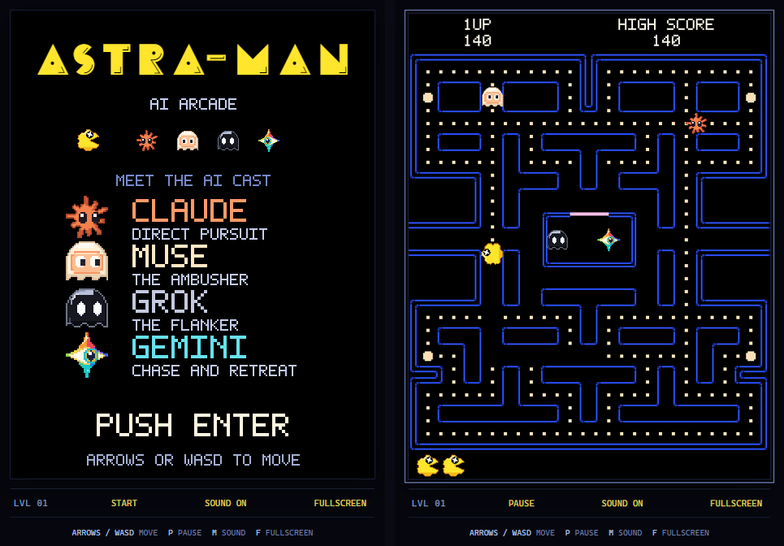<br>
  <sub><b>Build 3: the new cast in game.</b> Still on the arcade maze and layout.</sub>
</p>

<p align="center">
  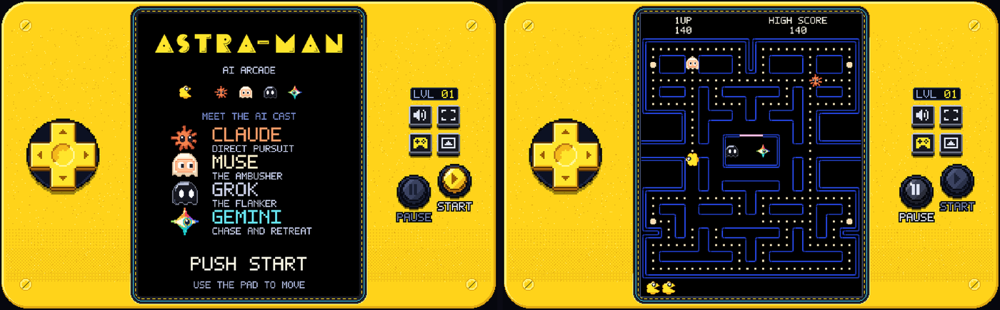<br>
  <sub><b>Build 4: the cabinet.</b> The touch deck and p5.js backdrops. The bezel turns blue while the ghosts are frightened.</sub>
</p>

**The name.** I first called the game ASTRA-MAN because it fit the vibe. Then I realised it would be funnier to call it SORA-MAN, since the hero was already based on Sora. The endless mode became **SUNSET**, *a climb away from permanent deletion*. A few quiet nods went in:

- The boot screen *denoises* instead of loading.
- An intermission opens a vault of licensed characters, then the deal closes.
- The ending card reads *THE PRODUCT MAY BE OFFLINE. / BUT NOTHING IS EVER REALLY GONE.*

Internal ids stayed `astra-*`, so existing saves and high scores kept working.

### 4. From clone to platform

A big refactor came next.

- **Registries, not features.** Instead of writing features *into* the engine, the engine grew registries and hook points for rulesets, mutators, statuses, power-ups, ghost brains and skills (`onTick`, `collision`, `speedScale`, `mapForLevel` and more).
- **A verified no-op.** With nothing registered, every hook passes its value through unchanged. A four-minute scripted comparison against the previous engine matched sample for sample, and the replay test stayed byte-identical.
- **Everything after that plugged in.** Every mode is a pure registration in `modes.js`, so none of them touched the classic rules.

What was built on top, in order:

- **AI artifacts.**
  - Pellets became gold GPU dies, and power pellets became full GPU chips.
  - The bonus fruit became artifacts a rogue AI collects. They escalate from books through repos, model hubs and weights up to an API key, a browser and root.
- **Co-op.**
  - Up to four stars (Sora, Nova, Vega, Lyra) share one pool of lives.
  - Each ghost hunts the nearest player it can hurt.
- **Mazes.**
  - **Neural Net**, **Server Room** (near-dark, lit only by the characters) and **Astra**.
  - A validator checks every maze: a sealed pen, every pellet reachable, tunnels open at both ends, and *no dead ends*.
  - A maze editor supports mirroring, undo and share-by-URL.
- **Juice.** `effects.js` reads the engine and never writes to it. It adds neon walls, character lighting, particles, cornering sparks, afterimages, screen shake, a death glitch and a CRT mode. Because it is presentation-only, the replay test still passed byte for byte.

<p align="center">
  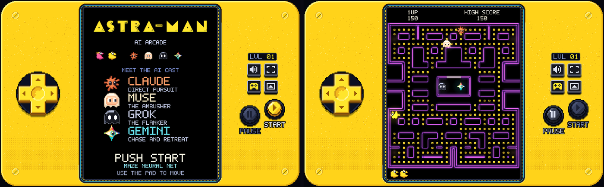<br>
  <sub><b>Build 5: new mazes and the effects layer.</b> Neural Net, with characters lighting the walls.</sub>
</p>

- **Remix.**
  - Seven power-ups: Token Beam, Rate Limit, Context Overflow, Scale Up, RAG, Hot Path and Incognito.
  - Four skills: Star Dash, Supernova, Pulse Shield and Vine Snare.
  - **Constellation**: two skills fired together link the players with a ghost-busting beam.
  - Two new ghost brains: a *charger* and a *sleeper*.
- **Versus Arena**, a battle royale for four:
  - Dots build speed.
  - The power pellet runs away.
  - Eaten players become spirits who tag their way back.
  - Gemini plants a *prompt injection* you have to pass on.
- **Meta-game.** A profile with XP, credits, a wardrobe and 18 achievements. A title menu replaced the old keyboard shortcuts.

<p align="center">
  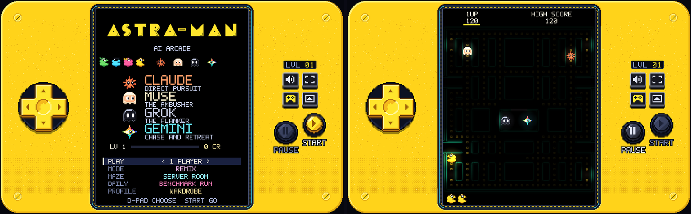<br>
  <sub><b>Build 6: modes and menus.</b> Remix on Server Room, which is lit only by the characters.</sub>
</p>

- **The endless maze generator** (`mazegen.js`):
  - It follows the *idea* of the piece-based generator in Shaun Williams' remake (masonicGIT/pacman), reimplemented from scratch for an endless climb.
  - The left half is a grid of cells joined into pieces. Each piece becomes a wall block and each boundary becomes a corridor, then the half is mirrored.
  - It grows upward one band at a time, with no dead ends and no open 2 × 2 areas, and each band is checked for connectivity.
  - The climb passes through a *zone* per bundled maze, blending layout style, wall colour and darkness.

<p align="center">
  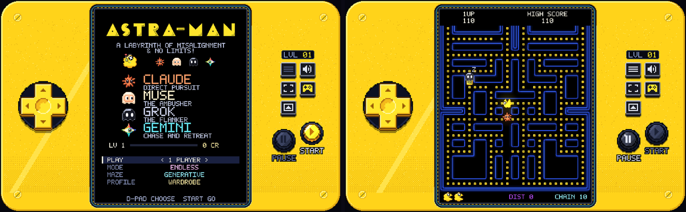<br>
  <sub><b>Build 7: ASTRA-MAN, the last build before the rename.</b> The endless mode running on a generated maze.</sub>
</p>

- **The trailer.** It is a 1:52 trailer made entirely in code, in six revisions:
  - Playwright captures real, seeded gameplay.
  - A canvas and p5.js compositor lays it into painted scenes.
  - A chiptune score is generated in code at 128 BPM.
  - ffmpeg encodes it at −14 LUFS.
  - Revision 5 followed a written "director's critique": cut Remix to four showcases, add a cold open, fix label collisions and ration the sound stickers. Revision 6 re-captured Versus so the hero actually wins.
  - The pipeline ships in [`trailer/`](trailer/ANIMATION_GUIDE.md), without its art or video.
- **Versus bots.** Bots hunt one rival at a time, flee threats, and chase the runaway pellet once they're fast enough.

<p align="center">
  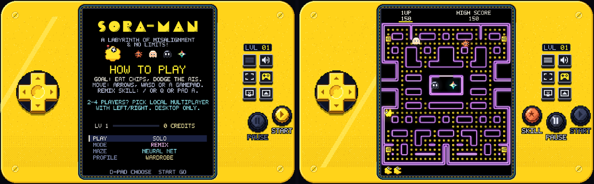<br>
  <sub><b>Build 8: SORA-MAN, the release build.</b> How-to-play on the title, and Remix on Neural Net.</sub>
</p>

### 5. The release audit

Before release, Opus 5.5 was asked for a **full pre-release diagnostics pass**:

- Read every module and trace how systems interact.
- Classify each problem as blocker, high, medium or low.
- Back every claim with the code or a simulation.

It **ran the game headlessly** as well: 68 bot-only Versus matches across all four mazes, plus co-op Sunset runs with one player climbing and one idle.

| Finding | Evidence |
|---|---|
| In a one-human Versus match, **WASD steered a bot**, not you | Traced from the key-to-player mapping |
| **Everyone was a spirit 22% of the time**, with nobody left to tag (longest stretch 72 s) | 20 simulated matches |
| The closing arena ended with **3–4 players eliminated in the same tick**, and an arbitrary winner | 16 of 48 simulated matches |
| A lagging co-op player could be **scrolled off-screen and stay alive, invisible and stuck** for up to 28 s | Sunset co-op simulation |
| Bots **reversed direction about 3.4 times a second** | 10 matches, broken down by bot state |
| No lobby existed: games started with **players who had no controller** | Traced from the start paths |

The fixes:

- **Real local multiplayer.**
  - Every input resolves to a *device*: a keyboard scheme, a gamepad or the touch deck. Only a seat's own device drives it.
  - A lobby with a ready-up proof and a 3-second countdown that cancels on any change.
  - Pad disconnects pause the match, and the same pad reconnecting takes its seat back.
- **Versus rules.**
  - The last live star can't be turned into a spirit.
  - Spirits re-form if nobody is left to tag.
  - The arena stops closing at the largest central region that still holds a corridor loop.
- **Bots rewritten.**
  - They decide once per tile, commit to goals, and turn back only to escape. Reversals fell to about 0.5–1.2 a second.
  - **Easy / Normal / Hard** change only decision quality (reaction time, mistakes, awareness, commitment), never speed.
- **Sunset co-op.** Players left below the screen are deleted, after a warning. An off-by-one in revive tokens was fixed.

<p align="center">
  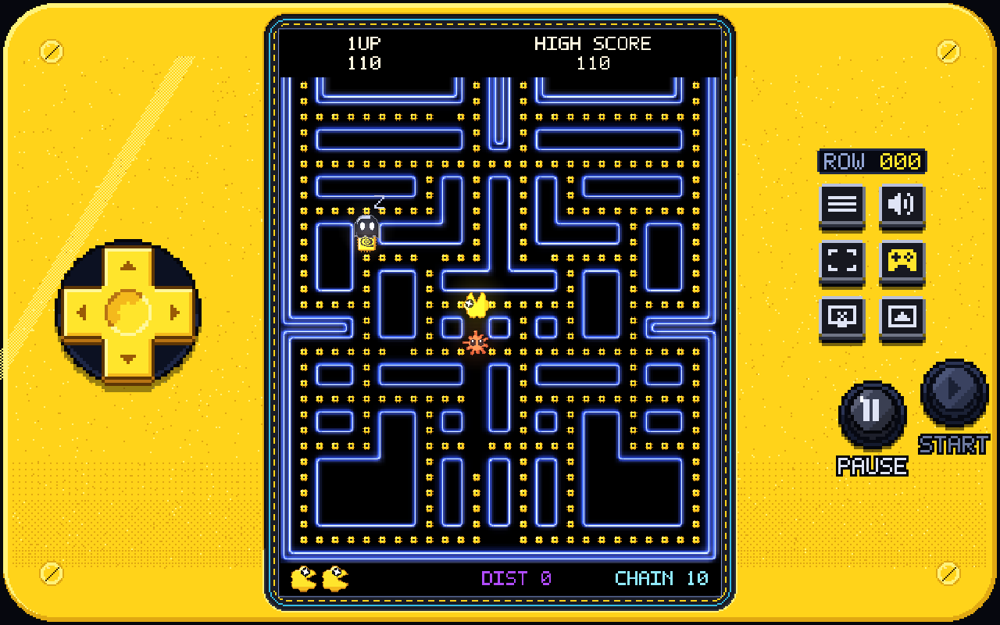<br>
  <sub>SUNSET, the endless climb, in the release build.</sub>
</p>

The test suite grew to **188 tests**, including simulation tests that fail if a bot stalls, the arena wipes everyone out, or a player gets stranded off-screen. Every finding, with its evidence and fix status, is in [`docs/release-readiness.md`](docs/release-readiness.md).

---

## Best practices and findings

1. **Snapshot before every change.** There are 33 dated backups. A project skill (`.claude/skills/backup`) copies the source before any non-trivial edit, which made it painless to let the agent try bold things.
2. **Ask for outcomes and evidence, not code.** For example: "prove the bots don't stall over 100 matches", or "four players need to be able to tell who is who". The agent picks the implementation. You pick the acceptance test.
3. **Long runs find the real bugs.** Bot and multiplayer bugs only showed up over long runs. Headless simulations found spirit deadlocks, simultaneous eliminations and stranded players that a few rounds of playtesting missed. Every random choice goes through one seeded generator, so a bug seen once replays exactly.
4. **Recorded arcade audio was a dead end** for a public release. Generating sounds that follow the originals' pitch contours was the fix: recognisable, but new.
5. **Registries before features.** The framework refactor is why four very different modes fit in one engine without breaking the arcade rules.
6. **Critique like a player.** Many of the best changes came from plain written feedback on renders and captures, like "the arms aren't varying length" or "per-frame label re-placement is jarring".
7. **Write it down.** The technical README, handoff documents and validation notes were updated with every phase, so each new session started from the truth.
8. **Opus 5.5 is seriously good at this.** It wrote its own chase logic, rebuilt the bots from simulation data and directed its own trailer.

What didn't work: a daily run and a time-attack mode were built and then pulled from the menu, because they diluted the offer. The time-attack still exists behind `#mode=benchmark`.

---

## Deep dives

Short summaries follow. The full detail is in [`docs/TECHNICAL.md`](docs/TECHNICAL.md).

- **Engine** (`engine.js`):
  - A 224 × 288 logical screen of 8-pixel tiles, stepped at a fixed 60 Hz.
  - Speeds, fright times, Elroy thresholds and fruit timing come from the arcade tables.
  - Rulesets plug into documented hooks.
- **Art** (`character-art.js`, `item-art.js`, `art.js`):
  - Every sprite is a 32 × 32 raster authored in code and cached as a canvas.
  - Maze walls are traced from the tile map into rounded contours.
  - Sprites are drawn at whole-pixel scales only.
- **Audio** (`audio.js`, `sound-bank.js`):
  - 39 generated clips on separate game and UI buses.
  - Priority channels mean four players eating at once never stack.
- **Modes** (`modes.js`): Remix, Sunset and Versus are pure registrations of statuses, power-ups, brains, skills and ruleset hooks.
- **Endless maze** (`mazegen.js`): a mirrored piece generator. It grows one band at a time, is checked for connectivity, and blends between maze styles.
- **Local multiplayer** (`input.js`, `lobby.js`):
  - Devices, seats, the ready-up state machine and disconnect handling, as pure modules.
  - Node tests cover joins, held keys, cross-seat ready attempts, disconnects and reconnects.
- **Bots** (Versus, in `modes.js`): breadth-first path steps with straight-ahead tie-breaks, goal commitment, and a per-level table for perception and decision quality.

## Bundled tooling

| Tool | Where | What it's for |
|---|---|---|
| **Audio generators** | [`scripts/`](scripts/AUDIO.md) | The synthesis kit, voices, the gameplay and UI generators, the jfxr demo generator, audition pages and the sound-bank packer |
| **Trailer pipeline** | [`trailer/`](trailer/ANIMATION_GUIDE.md) | Gameplay capture, a timeline-driven compositor, 64 × 64 hero sprites, a score built in code, and an ffmpeg render. Source and docs only; the art and video are not included. |
| **Maze editor** | [`tools/maze-editor.html`](tools/maze-editor.html) | Draw, mirror, validate and share mazes by URL |
| **itch.io packager** | `scripts/build-itch.py` | Builds the upload zip and reports anything missing |
| **Agent skills** | [`.claude/skills/`](.claude/skills) | The project workflows the agents used: backup, new mode, new power-up, new ghost brain, new map, art review, itch build |

## By the numbers

| | |
|---|---|
| Development time | About 24 hours |
| Source snapshots | 33 |
| Runtime JavaScript | About 8,600 lines across 19 files, no dependencies except a vendored p5.js for the backdrops |
| Tests | 188 (Node's built-in runner), plus optional browser suites |
| Tooling scripts | About 1,900 lines (audio generators, packaging, art review) |
| Trailer pipeline | About 3,300 lines |
| Generated sounds | 39 |
| Sprite frame and state combinations checked | 768 |
| Modes / mazes / power-ups / skills / achievements | 4 (+1 hidden) / 4 + editor / 7 / 4 / 18 |
| Upload size | About 4.9 MB zipped (the sound bank is most of it) |

## Run it locally

Nothing to install. Open `index.html`, or serve the folder:

```bash
python -m http.server 8765 --bind 127.0.0.1
```

Then visit http://127.0.0.1:8765/.

Run the tests with Node 20 or newer:

```bash
node --test tests/engine.test.js tests/audio.test.js tests/art.test.js tests/effects.test.js tests/modes.test.js tests/meta.test.js tests/hallucination.test.js tests/versus.test.js tests/mazegen.test.js tests/input.test.js
```

Package for itch.io with `python scripts/build-itch.py`.

## Repository layout

```
index.html, style.css      the page and cabinet
engine.js                  arcade rules, registries and hooks
modes.js                   Benchmark (hidden), Remix, Sunset, Versus (+ bots)
mazegen.js, maps.js        endless generator, bundled mazes
input.js, lobby.js         devices, seats, ready-up
game.js                    loop, rendering, input routing, menus
art.js, character-art.js, item-art.js    procedural sprites and mazes
effects.js, overlays.js    presentation-only juice, gameplay overlays
audio.js, sound-bank.js    playback and the embedded generated sound set
controls.js, backdrops.js  touch deck, keycaps, p5 cabinet backdrops
meta.js, profile-screen.js profile, unlocks, achievements
assets/audio/              the generated clips (WAV) and their manifest
tests/                     Node suites and browser fixtures
scripts/                   audio generators, itch packaging, art review (see AUDIO.md)
tools/maze-editor.html     the maze editor
trailer/                   the code-built trailer pipeline (no art or video)
docs/                      technical reference, release audit, handoffs, media
```

## Licence, credits and disclaimers

**Licence summary** (full text in [`LICENSE`](LICENSE)):

- **Code**: [MIT](LICENSE).
- **Art, characters, sounds and media**: [CC BY-NC 4.0](LICENSES/CC-BY-NC-4.0.txt). This covers the sprite designs, the generated audio, `sound-bank.js` and `docs/media/`. Share and remix them with credit, but not commercially.

**Credits:**

- **Agents and models:** GPT-6 Astra (Codex), Claude Opus 5.5 (Claude Code), GPT Image 2.5. See [Who built what](#who-built-what).
- **[masonicGIT/pacman](https://github.com/masonicGIT/pacman)** (Shaun Williams' remake, GPL-3.0): the reference used to improve the clone, and the idea behind the endless maze generator. No code from it is included.
- **[jfxr](https://github.com/ttencate/jfxr)** by Thomas ten Cate (BSD-3-Clause): used for the jfxr sound pass. It is not vendored; see [`scripts/AUDIO.md`](scripts/AUDIO.md).
- **Title font:** *Crackman Front* by Raymond Larabie, CC0 (`assets/fonts/license.txt`).
- **p5.js** 2.x, © the Processing Foundation and contributors, LGPL-2.1, vendored in `vendor/` for the backdrops.
- **Rules research:** the arcade game's behaviour as documented by the community in *The Pac-Man Dossier*. The arcade recordings used only to measure pitch contours are **not** in this repository or the game.

**Trademarks:** Sora, Claude, Gemini, Grok, Muse, Nvidia, GitHub, Hugging Face, Pac-Man and all related names belong to their owners. The characters and bonus items are affectionate pixel homages. This is an unofficial, non-commercial fan tribute, not affiliated with, endorsed by or sponsored by any of those companies. The early build screenshots show the arcade clone's original title card as a historical record.
